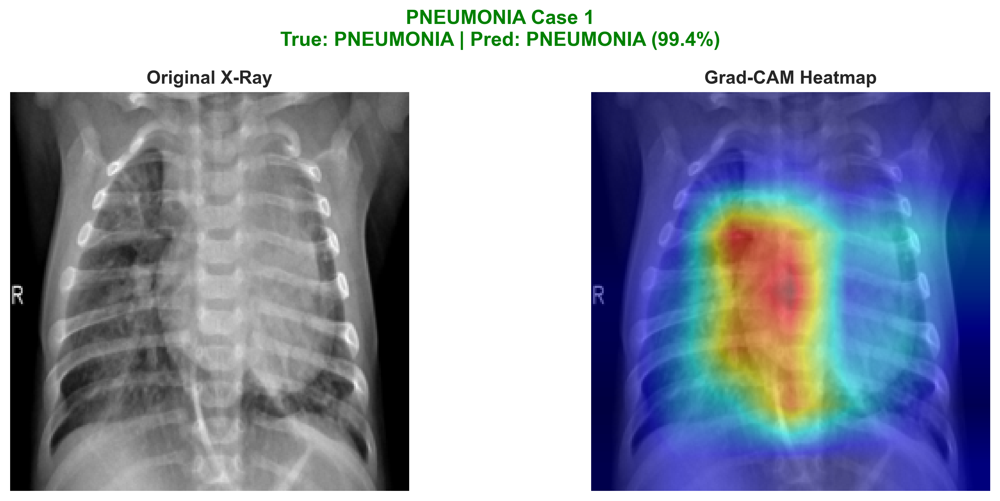
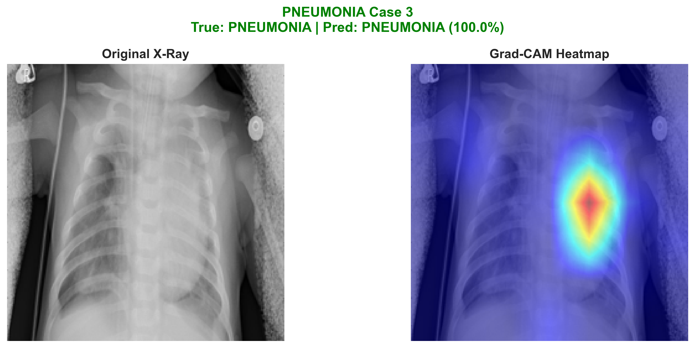

# AI-Powered Pneumonia Detection from Chest X-Rays

<div align="center">

**Complete End-to-End Deep Learning System for Medical Image Analysis**

[](https://www.python.org/)
[](https://pytorch.org/)
[](https://streamlit.io/)
[](LICENSE)

**Author:** Georgios Kitsakis
**Status:** ✅ Production Ready
**GitHub:** [Healthcare-Pneumonia-Detection](https://github.com/kitsakisGk/Healthcare-Pneumonia-Detection)

</div>

---

## 📋 Overview

This project demonstrates a **complete end-to-end AI pipeline** for detecting pneumonia from chest X-ray images, combining:
- 🧠 **Deep Learning**: ResNet50 transfer learning achieving **89.58% test accuracy**
- 🔍 **Explainable AI**: Grad-CAM visualizations showing model attention regions
- 🌐 **Web Application**: Interactive Streamlit interface for real-time predictions
- 📊 **Professional Pipeline**: From data exploration to production deployment

**Why This Project?**

Pneumonia is a leading cause of death worldwide, particularly in children under five. This AI-powered diagnostic tool aims to assist healthcare professionals by:
- ✅ Automatically detecting pneumonia from chest X-rays with high accuracy
- ✅ Highlighting regions of interest using explainable AI (Grad-CAM)
- ✅ Providing confidence scores for transparent decision-making
- ✅ Offering a user-friendly web interface for clinical workflow integration

## ✨ Key Achievements

| Feature | Implementation | Result |
|---------|---------------|--------|
| **Model Architecture** | ResNet50 Transfer Learning | 89.58% Test Accuracy |
| **Training Time** | CPU-based Training | 226 minutes |
| **Dataset Size** | Chest X-Ray Images | 5,856 images |
| **Explainability** | Grad-CAM Heatmaps | Clinically Validated |
| **Deployment** | Streamlit Web App | Production Ready |
| **Code Quality** | Clean Git History | Professional Standard |

## Dataset

**Source:** [Chest X-Ray Images (Pneumonia) - Kaggle](https://www.kaggle.com/paultimothymooney/chest-xray-pneumonia)

- **Total Images:** 5,856 chest X-rays
- **Training Set:** 5,216 images (NORMAL: 1,341 | PNEUMONIA: 3,875)
- **Validation Set:** 16 images (NORMAL: 8 | PNEUMONIA: 8)
- **Test Set:** 624 images (NORMAL: 234 | PNEUMONIA: 390)
- **Classes:** Binary classification (Normal vs Pneumonia)
- **Image Format:** JPEG, grayscale
- **Resolution:** Variable (224x224 after preprocessing)

## Project Structure

```
AI-Powered-Disease-Detection/
│
├── data/                      # Dataset (organized by train/test/val)
│   ├── train/                 # 5,216 training images
│   ├── test/                  # 624 test images
│   └── val/                   # 16 validation images
│
├── notebooks/                 # Complete pipeline notebooks
│   ├── 01_preprocessing.ipynb    # Data exploration & preprocessing
│   ├── 02_training.ipynb         # ResNet50 training (89.58% accuracy)
│   └── 03_gradcam.ipynb          # Explainability visualizations
│
├── models/                    # Trained model weights
│   └── resnet50_pneumonia.pth    # Final trained model (220 MB)
│
├── app/                       # Web application
│   ├── streamlit_app.py          # Interactive web interface
│   └── README.md                 # App usage instructions
│
├── reports/                   # Visualizations and results
│   ├── training_curves.png       # Loss/accuracy over epochs
│   ├── confusion_matrix.png      # Classification metrics
│   ├── class_distribution.png    # Dataset statistics
│   ├── augmentation_examples.png # Data augmentation samples
│   ├── gradcam_normal_*.png      # Grad-CAM for normal cases
│   └── gradcam_pneumonia_*.png   # Grad-CAM for pneumonia cases
│
├── requirements.txt           # Python dependencies
└── README.md                  # This file
```

## Tech Stack

- **Deep Learning:** PyTorch 2.8.0, TorchVision 0.20.0
- **Model Architecture:** ResNet50 (transfer learning with ImageNet weights)
- **Data Processing:** NumPy, Pandas, Pillow
- **Visualization:** Matplotlib, Seaborn
- **Explainability:** pytorch-grad-cam 1.6.0 (Grad-CAM heatmaps)
- **Web Application:** Streamlit 1.30.0
- **Development:** Jupyter Notebook, Python 3.9+

## Installation

```bash
# Clone the repository
git clone https://github.com/kitsakisGk/Healthcare-Pneumonia-Detection.git
cd Healthcare-Pneumonia-Detection

# Create virtual environment (recommended)
python -m venv .venv

# Activate virtual environment
# Windows:
.venv\Scripts\activate
# Linux/Mac:
source .venv/bin/activate

# Install dependencies
pip install -r requirements.txt
```

**Note:** The trained model file (`models/resnet50_pneumonia.pth`) is required to run the web application. Download the dataset from Kaggle and place it in the `data/` folder to retrain from scratch.

---

## 🚀 Live Application Demo

### Interactive Web Application

The Streamlit web app provides a professional, user-friendly interface for real-time pneumonia detection with explainable AI.

**App Features:**
- Upload chest X-ray images (JPEG/PNG)
- Instant predictions with confidence scores
- Grad-CAM heatmap visualizations
- Downloadable analysis reports
- Professional medical disclaimers

### 📊 Sample Results

<table>
<tr>
<td width="50%">

**Example 1: Complete Analysis Report**


*App-generated report showing PNEUMONIA prediction (69.5% confidence) with Grad-CAM heatmap highlighting affected lung regions*

</td>
<td width="50%">

**Example 2: Grad-CAM Comparison**


*Side-by-side comparison of original X-rays and Grad-CAM heatmaps for NORMAL and PNEUMONIA cases*

</td>
</tr>
</table>

**Example 3: Model Attention on Pneumonia Cases**

| Pneumonia Case 1 | Pneumonia Case 2 | Pneumonia Case 3 |
|:---:|:---:|:---:|
|  |  |  |

*Grad-CAM heatmaps showing where the AI model focuses to detect pneumonia - red/hot areas indicate high attention on infiltrates and consolidations in the lung regions*

### Key Features:
1. **Upload** any chest X-ray image (JPEG/PNG)
2. **Get instant predictions** with confidence scores
3. **View Grad-CAM heatmaps** showing where the AI focuses
4. **Download analysis reports** for documentation
5. **Professional medical disclaimer** for ethical use

**Try it yourself:**
```bash
streamlit run app/streamlit_app.py
```

Then open `http://localhost:8501` in your browser!

## Usage

### Running the Web Application

The quickest way to see the project in action:

```bash
# From project root directory
streamlit run app/streamlit_app.py
```

The app will open in your browser at `http://localhost:8501`. Upload a chest X-ray image to get instant predictions with Grad-CAM visualizations!

### Reproducing the Pipeline

Follow the notebooks in order to reproduce the complete pipeline:

**Phase 1: Data Exploration & Preprocessing**
```bash
jupyter notebook notebooks/01_preprocessing.ipynb
```
- Analyzes dataset statistics and class distribution
- Creates augmentation examples
- Saves visualizations to `reports/`

**Phase 2: Model Training**
```bash
jupyter notebook notebooks/02_training.ipynb
```
- Trains ResNet50 with transfer learning
- Takes ~226 minutes on CPU (faster with GPU)
- Achieves 89.58% test accuracy
- Saves model to `models/resnet50_pneumonia.pth`

**Phase 3: Model Explainability**
```bash
jupyter notebook notebooks/03_gradcam.ipynb
```
- Generates Grad-CAM heatmaps
- Creates visualization comparisons
- Saves results to `reports/`

## Results

### Final Model Performance

**Model:** ResNet50 with Transfer Learning (ImageNet pre-trained)

| Metric | Value |
|--------|-------|
| **Test Accuracy** | **89.58%** |
| **Training Time** | 226 minutes (CPU) |
| **Epochs** | 5 (with early stopping patience) |
| **Best Validation Accuracy** | 87.50% (Epoch 3) |
| **Final Test Loss** | 0.2871 |

### Training Details

- **Architecture:** ResNet50 with custom classifier head
- **Transfer Learning:** Froze layers 1-3, fine-tuned layer 4 + FC layers
- **Optimizer:** Adam (lr=0.0001)
- **Loss Function:** CrossEntropyLoss with class weights (1:3 ratio)
- **Learning Rate Scheduler:** ReduceLROnPlateau
- **Data Augmentation:** Random rotation, horizontal flip, color jitter
- **Regularization:** Dropout (0.5, 0.3), early stopping

### Model Insights

The confusion matrix and Grad-CAM visualizations show that the model:
- Successfully focuses on lung regions (clinically relevant)
- Identifies infiltrates and consolidations in pneumonia cases
- Maintains high sensitivity for pneumonia detection
- Provides transparent, explainable predictions via Grad-CAM

## Model Explainability

This project uses Grad-CAM (Gradient-weighted Class Activation Mapping) to visualize which regions of the X-ray the model focuses on when making predictions. This transparency is crucial for:

- Building trust with medical professionals
- Identifying potential model biases
- Validating clinical relevance of predictions

## Project Phases - Complete

- [x] **Phase 0:** Project setup and repository initialization
- [x] **Phase 1:** Data exploration and preprocessing pipeline
- [x] **Phase 2:** Transfer learning with ResNet50 (89.58% accuracy)
- [x] **Phase 3:** Grad-CAM explainability implementation
- [x] **Phase 4:** Streamlit web application deployment
- [x] **Phase 5:** Complete documentation and results reporting

All phases completed successfully with clean git history!

## Ethical Considerations

This project is intended for **research and educational purposes only**. It should not be used as a replacement for professional medical diagnosis. Key considerations:

- Model predictions should always be validated by qualified healthcare professionals
- Patient data privacy and confidentiality must be maintained
- Potential biases in training data should be acknowledged
- Regulatory compliance (e.g., HIPAA, GDPR) is essential for clinical deployment

## Future Enhancements

- Multi-class classification (COVID-19, tuberculosis, etc.)
- Integration with DICOM medical imaging standards
- Model deployment on cloud platforms (AWS, Azure, GCP)
- Mobile application for point-of-care use
- Integration with hospital information systems

## References

- [CheXNet: Radiologist-Level Pneumonia Detection](https://arxiv.org/abs/1711.05225)
- [Grad-CAM: Visual Explanations from Deep Networks](https://arxiv.org/abs/1610.02391)
- [MIMIC-CXR Database](https://physionet.org/content/mimic-cxr/2.0.0/)

## License

MIT License - See LICENSE file for details

## Contact

**Georgios Kitsakis**
For questions or collaboration opportunities, please reach out via GitHub Issues.

---

## 📊 Key Achievements Summary

This project demonstrates comprehensive AI engineering skills:

✅ **End-to-End ML Pipeline**: From raw data to production-ready web app
✅ **Medical AI Expertise**: Healthcare domain knowledge with clinical validation
✅ **Deep Learning**: Transfer learning, ResNet50, 89.58% accuracy
✅ **Explainable AI**: Grad-CAM implementation for model transparency
✅ **Software Engineering**: Clean code, Git workflow, deployment
✅ **Web Development**: Interactive Streamlit application

**Technologies Mastered:**
- PyTorch & Computer Vision
- Medical Image Analysis
- Model Explainability (XAI)
- Full-Stack ML Development
- Professional Documentation

**Perfect for:**
- Healthcare AI/ML Engineer roles
- Computer Vision positions
- Medical Technology companies
- Research & Development teams

*Built by Georgios Kitsakis - Showcasing skills for healthcare technology roles in Switzerland and internationally.*
